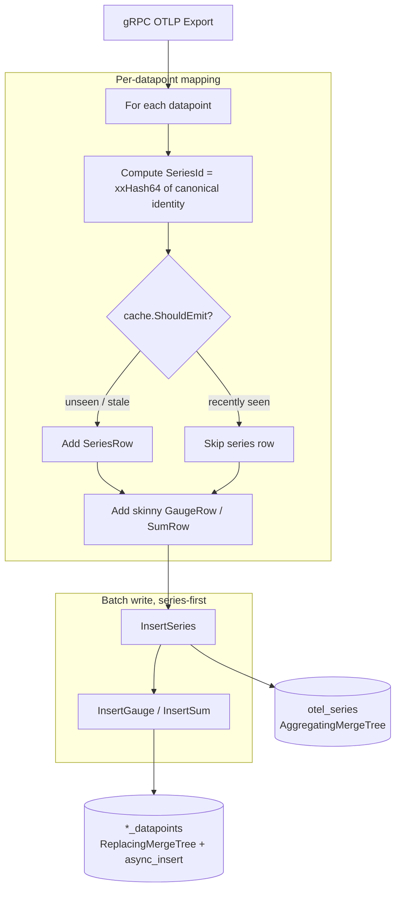

# Series / Datapoint Split — Design
> Status: draft

## Glossary
Consistent terminology used across code, schema, and docs:
- **Series** — a unique metric identity: the tuple of ServiceName, MetricName, MetricType,
  resource attributes, scope (name/version/attrs/schema), and datapoint attributes. One logical
  time-stream. (Prometheus uses the same word for the same concept.)
- **SeriesId** — a deterministic `uint64` hash of the series identity. Content-addressed: the same
  identity always yields the same id, computed locally with no coordination. Join key between the
  two table kinds. Canonical encoding is specified below and is **normative** — the migration MV
  recomputes it in SQL and must agree byte-for-byte.
- **Series table** (`otel_series`) — the lookup table holding one row per series identity plus its
  series-level constants. The dimension side of a star schema.
- **Datapoint** — a single observation of a series: `value + timestamp`, referencing a SeriesId.
- **Datapoint table** (`otel_metrics_gauge_datapoints`, `otel_metrics_sum_datapoints`) — skinny
  fact tables holding datapoints only. One per value shape. Named distinctly from the legacy wide
  tables so both can coexist during migration (see `4-migration.md`).
- **Series-level constant** — a field fixed for a series (MetricType, description, unit,
  AggregationTemporality, IsMonotonic). Stored once on the series row, never per datapoint.
- **Event time** — a datapoint's own `TimeUnix` (when it was measured). **Ingest time** — wall clock
  when we received it. They differ arbitrarily (collector buffering, retries, backfill); only event
  time is ever used in query predicates.
- **Active series** — a series seen within the dedup cache's TTL window; the working set the cache
  tracks.

## Approach
Introduce a content-addressed `SeriesId` = deterministic hash of the series identity, computed in
Go at ingest. A series identity is written once to the shared `otel_series` table (deduped via an
in-process cache + ClickHouse `AggregatingMergeTree`); datapoints are written to skinny per-shape
tables carrying only `SeriesId + timestamp + value fields`. Reads resolve SeriesIds from the small
series table, then range-scan datapoints by SeriesId + time.

## SeriesId canonical encoding (normative)
The join key of the whole system. Go and ClickHouse **must** produce identical values, or the
migration's old and new write paths mint different ids for the same series (split identities that a
row-count parity check would not catch). Therefore the encoding is pinned here:

1. Attribute maps are serialised as `k1=v1,k2=v2,…` with **keys sorted lexicographically** (byte order).
2. Fields are joined in **exactly this order**, separated by `\x1f` (unit separator, cannot occur in
   OTLP attribute strings):
   `ServiceName · MetricName · MetricType · ResourceSchemaUrl · ScopeName · ScopeVersion ·
   ScopeSchemaUrl · ResourceAttributes · ScopeAttributes · Attributes`
3. `SeriesId = xxHash64(utf8_bytes(encoded))`, seed 0 (`cespare/xxhash/v2` in Go; `xxHash64()` in
   ClickHouse — both are XXH64/seed-0, so identical bytes give identical output).

`ScopeDroppedAttrCount` is **not** part of the identity (it's an incidental counter, not identifying).
A test asserts Go's `seriesID` equals ClickHouse's `xxHash64` on a shared fixture (task 2).

## Components

### SeriesId hasher (`metrics_mapper.go`)
- **Responsibility**: derive a stable `uint64` SeriesId per the canonical encoding above.
- **Interface**: `seriesID(identity) uint64`.
- **Dependencies**: `cespare/xxhash/v2`. Pure function.

### Series dedup cache (`series_cache.go`, new)
- **Responsibility**: decide whether a series row needs (re)emitting, keeping series-table writes
  off the per-datapoint hot path.
- **Why it matters**: without it, a series row is written **per datapoint**, turning `otel_series`
  into a second write-heavy table — write amplification plus the background merge load of collapsing
  all those rows. The cache collapses that to ~one write per series per `refreshInterval`, so
  series-table writes scale with `# series × refresh rate`, not datapoint count (C-3).
- **Interface**: `ShouldEmit(id uint64, now time.Time) bool` — true if unseen or `lastEmitted` older
  than `refreshInterval`.
- **Config** (env-overridable; defaults pinned so nothing is invented at implementation time):
  `refreshInterval = 5m`, `maxEntries = 100_000`, `idleTTL = 1h`.
- **Dependencies**: `hashicorp/golang-lru/v2/expirable` (concurrent LRU + TTL).
- **Correctness never depends on cache state (C-4)** — it is purely write reduction. This is only
  true because **no query predicate reads `FirstSeen`/`LastSeen`** (see Alternatives → windowed
  prune). Evicting or losing the cache costs redundant, idempotent re-emits and nothing else.

### MetricsStore (`clickhouse_client.go`)
- **Responsibility**: create tables; upsert series rows; batch-insert skinny datapoints.
- **Interface**: `CreateTables`, `InsertSeries(ctx, []SeriesRow)`, `InsertGauge(ctx, []GaugeRow)`,
  `InsertSum(ctx, []SumRow)` (GaugeRow/SumRow now skinny, identical shape).
- **Dependencies**: ClickHouse driver, with `async_insert = 1` **and `wait_for_async_insert = 1`**.
  The wait keeps the server-side batching win while preserving a durable ack — the `Export` handler
  must not return success before the data is committed (OTLP clients treat success as delivered), and
  it also stops reads from racing the flush in tests.

### MetricsQuerier (`metrics_query.go`, new)
- **Responsibility**: encapsulate the two-step read (resolve SeriesIds from `otel_series` →
  range-scan the datapoint table by SeriesId + time) so callers pass a typed filter, not SQL. The
  read-side analog of `MetricsStore`; the same concrete `ClickHouseMetricsStore` implements it. Not
  exposed over the network (NG-1) — it backs the integration test now and any future endpoint.
- **Interface** — **the time-frame is the only mandatory *filter*** (C-2). `MetricType` is also
  required, but it is a **table selector, not a filter dimension**: it picks which value-shape table
  to read, not which rows to narrow to. Every actual filter is optional and its SQL clause is omitted
  entirely when unset:
  ```go
  type DatapointQuery struct {
      From, To    time.Time         // REQUIRED — the only mandatory filter (C-2)
      MetricType  string            // REQUIRED — "gauge" | "sum"; selects the datapoint table
      ServiceName string            // optional; omitted from SQL when ""
      MetricName  string            // optional; omitted from SQL when ""
      Attributes  map[string]string // optional; datapoint-level attribute equality
      ResourceAttributes map[string]string // optional; resource-level attribute equality
      Limit       int               // default 10_000 — results are bounded, never unbounded
  }
  type Datapoint struct {
      SeriesId    uint64
      ServiceName string   // resolved from the series row so results are self-describing
      MetricName  string
      TimeUnix    time.Time
      Value       float64
  }

  QueryDatapoints(ctx context.Context, q DatapointQuery) ([]Datapoint, error)
  ```
- **Attribute matching**: use `mapContains(m, k) AND m[k] = v`, never bare `m[k] = v` — ClickHouse
  returns `''` for a missing key, so a bare comparison against `''` would match rows *lacking* the key.

### Export handler (`metrics_service.go`)
- **Responsibility**: map request → SeriesIds; emit series rows (gated by cache, series-first) then
  datapoints. Wiring only.

## Data flow
Per `Export`, each datapoint is mapped to a SeriesId and a skinny row; the series row is emitted
only when the dedup cache says so. The batch then writes **series-first**, so a crash between the
two inserts leaves at worst a harmless orphan series row, never a dangling datapoint.



**Retry safety**: OTLP clients retry on timeout/`UNAVAILABLE`, and the handler returns errors to the
client, so a partially-failed batch **will** be re-sent. Both tables therefore collapse duplicates by
sorting key — `otel_series` via `AggregatingMergeTree`, the datapoint tables via
`ReplacingMergeTree ORDER BY (SeriesId, TimeUnix)` (a repeated `(SeriesId, TimeUnix)` *is* a
duplicate by definition). Without this, retries would double-count. A reader in the sub-second gap
between the two writes treats an unknown SeriesId as "series pending", not an error; it self-heals
on the next batch.

## Schema changes

**`otel_series`** — the series lookup. `AggregatingMergeTree` merges repeated emits of the same
series into one row: `min(FirstSeen)` / `max(LastSeen)` for the activity window, and explicit
aggregate functions on every non-key column so merge behaviour is declared rather than incidental
(plain columns would collapse to an *arbitrary* row's value, not "latest wins").

`FirstSeen`/`LastSeen` are **event time** (derived from the datapoints' `TimeUnix`), not ingest time
— so the TTL below and any future window logic compare like with like. They are **metadata only**:
no query predicate depends on them (see Alternatives).

```sql
CREATE TABLE IF NOT EXISTS otel_series (
    SeriesId               UInt64 CODEC(ZSTD(1)),
    ServiceName            LowCardinality(String) CODEC(ZSTD(1)),
    MetricName             LowCardinality(String) CODEC(ZSTD(1)),
    MetricType             LowCardinality(String) CODEC(ZSTD(1)),
    ResourceAttributes     SimpleAggregateFunction(any, Map(LowCardinality(String), String)) CODEC(ZSTD(1)),
    ResourceSchemaUrl      SimpleAggregateFunction(any, String) CODEC(ZSTD(1)),
    ScopeName              SimpleAggregateFunction(any, String) CODEC(ZSTD(1)),
    ScopeVersion           SimpleAggregateFunction(any, String) CODEC(ZSTD(1)),
    ScopeAttributes        SimpleAggregateFunction(any, Map(LowCardinality(String), String)) CODEC(ZSTD(1)),
    ScopeDroppedAttrCount  SimpleAggregateFunction(anyLast, UInt32) CODEC(ZSTD(1)),
    ScopeSchemaUrl         SimpleAggregateFunction(any, String) CODEC(ZSTD(1)),
    Attributes             SimpleAggregateFunction(any, Map(LowCardinality(String), String)) CODEC(ZSTD(1)),
    AggregationTemporality SimpleAggregateFunction(any, Int32) CODEC(ZSTD(1)),
    IsMonotonic            SimpleAggregateFunction(any, Bool) CODEC(ZSTD(1)),
    MetricDescription      SimpleAggregateFunction(anyLast, String) CODEC(ZSTD(1)),
    MetricUnit             SimpleAggregateFunction(anyLast, String) CODEC(ZSTD(1)),
    FirstSeen              SimpleAggregateFunction(min, DateTime64(9)) CODEC(ZSTD(1)),
    LastSeen               SimpleAggregateFunction(max, DateTime64(9)) CODEC(ZSTD(1)),

    INDEX idx_res_attr_key   mapKeys(ResourceAttributes)   TYPE bloom_filter(0.01) GRANULARITY 1,
    INDEX idx_res_attr_value mapValues(ResourceAttributes) TYPE bloom_filter(0.01) GRANULARITY 1,
    INDEX idx_attr_key       mapKeys(Attributes)           TYPE bloom_filter(0.01) GRANULARITY 1,
    INDEX idx_attr_value     mapValues(Attributes)         TYPE bloom_filter(0.01) GRANULARITY 1
) ENGINE = AggregatingMergeTree()
ORDER BY (ServiceName, MetricName, SeriesId)
TTL toDateTime(LastSeen) + INTERVAL 90 DAY          -- dead series age out; bounds the IN-list (C-5 churn)
SETTINGS index_granularity = 8192;
```

`any` vs `anyLast`: identity columns are constant per `SeriesId` (they feed the hash), so `any` is
exact and merely makes the intent explicit. Description/unit can legitimately change, so `anyLast`.
The TTL only ever degrades `FirstSeen` precision on an isolated old part — never series existence —
which is safe precisely *because* no predicate depends on those columns.

**`otel_metrics_gauge_datapoints`** (and identical **`otel_metrics_sum_datapoints`**):

```sql
CREATE TABLE IF NOT EXISTS otel_metrics_gauge_datapoints (
    SeriesId      UInt64 CODEC(ZSTD(1)),
    StartTimeUnix DateTime64(9) CODEC(Delta(8), ZSTD(1)),
    TimeUnix      DateTime64(9) CODEC(Delta(8), ZSTD(1)),
    Value         Float64 CODEC(ZSTD(1)),
    Flags         UInt32 CODEC(ZSTD(1))
) ENGINE = ReplacingMergeTree()                     -- retried inserts collapse; see Retry safety
PARTITION BY toDate(TimeUnix)
ORDER BY (SeriesId, TimeUnix)
SETTINGS index_granularity = 8192, ttl_only_drop_parts = 1;
```

(Histogram/Exp-Histogram/Summary tables are out of scope per NG-2 — future features.)

## Canonical read query
What `MetricsQuerier.QueryDatapoints` builds and runs (documented in README, exercised by the
integration test **through the interface**, never as raw SQL in the test). Clauses for unset filters
are omitted entirely — only the time-frame is mandatory (C-2):

```sql
SELECT s.SeriesId, s.ServiceName, s.MetricName, dp.TimeUnix, dp.Value
FROM otel_metrics_gauge_datapoints AS dp
INNER JOIN (
        SELECT SeriesId, ServiceName, MetricName
        FROM otel_series
        WHERE 1=1
          -- AND ServiceName = :service            -- emitted only when set
          -- AND MetricName  = :metric             -- emitted only when set
          -- AND mapContains(Attributes, :k) AND Attributes[:k] = :v
    ) AS s ON s.SeriesId = dp.SeriesId
WHERE dp.TimeUnix BETWEEN :from AND :to             -- authoritative bound + partition prune
ORDER BY dp.SeriesId, dp.TimeUnix
LIMIT 1 BY dp.SeriesId, dp.TimeUnix                 -- collapse not-yet-merged Replacing duplicates
LIMIT :limit;                                       -- bounded result set
```

**No `FINAL`, deliberately.** The subquery reads only *identity* columns (`SeriesId`, `ServiceName`,
`MetricName`, attribute maps) — all constant per `SeriesId`, since they feed the hash. So unmerged
parts of `otel_series` carry identical values for those columns, and a raw-row filter is already
correct; duplicate `SeriesId`s from unmerged parts are absorbed by the join. `FINAL` would only be
needed to read a *merged* column (`FirstSeen`/`LastSeen`/`anyLast` metadata), and no predicate here
does. This is why the earlier windowed-prune design needed `FINAL` and this one does not.

`LIMIT 1 BY` handles the datapoint side: `ReplacingMergeTree` guarantees *eventual* dedup, so a read
before merge could otherwise see a retried datapoint twice.

## Metrics
- `series_registered_total` — counter, series rows emitted (want ≪ datapoints ingested).
- `series_cache_size` — gauge, active series tracked.
(Reuse existing `metricsReceivedCounter` for ingest volume.)

**Exposure**: instruments register on the existing global `MeterProvider` (`otel.go`), so no
per-metric wiring. That provider exports to **stdout** (`stdoutmetric`, 10s reader) — unchanged in
this feature. Routing the app's own metrics via OTLP back into its own ingest path (self-observability
/ dogfooding) is deferred to a separate roadmap feature (`metrics-self-observability`).

**Logging guidance** (applies throughout implementation): log heavily but meaningfully — every log
line should carry enough context to debug from alone, and no line should be noise. Use structured
`slog` with the request `context`, as the code already does.
- Include identifying context: `SeriesId`, `ServiceName`, `MetricName`, `MetricType`, batch sizes,
  and counts (datapoints in / series emitted vs. deduped). These are what make a line actionable.
- Level discipline: `Debug` for per-request/hot-path detail, `Info` for lifecycle (startup, table
  creation, shutdown), `Warn`/`Error` for failures.
- **Log an error exactly once, at the point it's handled.** If a function only propagates an error
  (`return fmt.Errorf(...)`), it does **not** log — the handler at the top of the call does. This
  avoids duplicate, context-poor error spam.
- Never log inside per-datapoint tight loops at `Info`+; aggregate to per-batch counts instead
  (keeps logging off the hot path, consistent with C-3).

## Alternatives considered
- **Windowed activity prune on the series subquery (rejected — it was in an earlier draft)**: filter
  the series subquery by `LastSeen >= :from AND FirstSeen <= :to` to shrink the `IN`-list to series
  live during the window. **It silently drops live data.** `LastSeen` only advances when the cache
  lets an emit through, so it lags reality by up to `refreshInterval`: a series ingesting right now
  but last emitted 50 min ago is pruned from a "last 5 minutes" query. Worse, the columns were ingest
  time while `:from`/`:to` filter *event* time — an unbounded skew under collector buffering or
  backfill, so no amount of shrinking `refreshInterval` fixes it. Making it correct means event-time
  columns **plus** a declared out-of-orderness bound (`maxSkew`) with padded predicates and
  emit-on-backward-extension in the cache — i.e. watermark semantics, whose `maxSkew` becomes a
  *correctness knob* that silently loses data when misconfigured. The prune's only win is a tighter
  `IN`-list, and each extra id costs one cheap primary-key seek inside already-partition-pruned data.
  We get the same bound structurally, without the correctness risk, via the series-table **TTL**.
  Revisit only if profiling proves the `IN`-list is the bottleneck.
- **Insert-time Materialized View fan-out (rejected)**: buys structural atomicity but the series MV
  amplifies (one row per datapoint) and adds synchronous insert-path CPU — bad for write-heavy.
  App-side dedup gives the same hot-path decoupling with less cost. See C-3, C-4.
- **Refreshable MV on a fat staging table (rejected)**: needs a persisted fat staging table (the
  skinny table can't reconstruct the identity) + windowed exactly-once batch logic. More moving
  parts than an in-memory cache the app already has the data for.
- **UUID SeriesId (rejected)**: random ids force a read-before-write to dedup. A deterministic hash
  is content-addressed → lookup-free, coordination-free dedup, and smaller (UInt64) per datapoint.
- **Plain `MergeTree` datapoints (rejected)**: appends duplicate rows on the OTLP client retries that
  happen routinely, double-counting values. `ReplacingMergeTree` costs slightly heavier merges and
  needs `LIMIT 1 BY` on pre-merge reads — a good trade against silently wrong values.

## Migration & compatibility
- **Ingest contract unchanged** — the gRPC OTLP `Export` surface is identical; producers need no
  change. The break is internal-only (`MetricsStore` Go interface + table schema), no external consumer.
- **Datapoint tables use distinct `_datapoints` names**, never reusing the legacy wide-table names.
  This avoids the `CREATE TABLE IF NOT EXISTS` trap (it silently keeps an existing table's old
  schema) and lets the new tables coexist with the legacy ones during a migration.
- **For an existing deployment with wide-table data**: an MV layered on the legacy wide tables mirrors
  the live insert stream into the new tables + a one-time backfill for history → a no-writer-change
  online migration. The MV must recompute `SeriesId` per the normative encoding above. Full runbook
  in `4-migration.md`.

## Risks
- **Hash collision** — negligible with 64-bit hash at low cardinality; widen if ever needed.
- **Go/ClickHouse hash divergence** — would split identities during migration and evade a row-count
  parity check. Mitigated by pinning the encoding (above) and a fixture test asserting the two agree.
- **Series-constant drift** (a producer flipping temporality/monotonicity mid-stream) — `any` keeps
  one value; if it must be distinguished, include it in the identity so drift mints a new series.
  Documented assumption.
- **Transient duplicate datapoints** before a `ReplacingMergeTree` merge — handled at read by
  `LIMIT 1 BY (SeriesId, TimeUnix)`.
- **Cold-start burst** — bounded and idempotent, so correctness holds without warm-up; the
  warm-read optimization is a separate future feature (NG-4).
