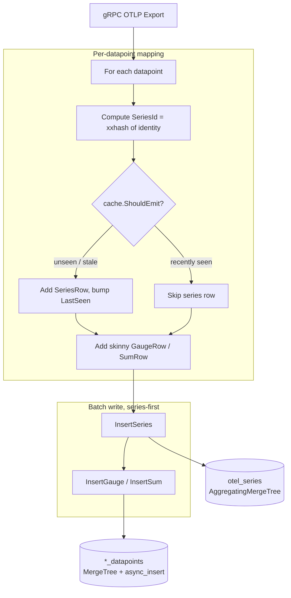

# Series / Datapoint Split — Design
> Status: draft

## Glossary
Consistent terminology used across code, schema, and docs:
- **Series** — a unique metric identity: the tuple of ServiceName, MetricName, MetricType,
  resource attributes, scope (name/version/attrs/schema), and datapoint attributes. One logical
  time-stream. (Prometheus uses the same word for the same concept.)
- **SeriesId** — a deterministic `uint64` hash of the series identity. Content-addressed: the same
  identity always yields the same id, computed locally with no coordination. Join key between the
  two table kinds.
- **Series table** (`otel_series`) — the lookup table holding one row per series identity plus its
  series-level constants. The dimension side of a star schema.
- **Datapoint** — a single observation of a series: `value + timestamp`, referencing a SeriesId.
- **Datapoint table** (`otel_metrics_gauge_datapoints`, `otel_metrics_sum_datapoints`) — skinny
  fact tables holding datapoints only. One per value shape. Named distinctly from the legacy wide
  tables so both can coexist during migration (see `4-migration.md`).
- **Series-level constant** — a field that is fixed for a series (MetricType, description, unit,
  AggregationTemporality, IsMonotonic). Stored once on the series row, never per datapoint.
- **Active series** — a series seen within the dedup cache's TTL window; the working set the cache
  tracks.

## Approach
Introduce a content-addressed `SeriesId` = deterministic hash of the series identity, computed in
Go at ingest. A series identity is written once to the shared `otel_series` table (deduped via an
in-process cache + ClickHouse `AggregatingMergeTree`, which merges `min(FirstSeen)`/`max(LastSeen)`);
datapoints are written to skinny per-shape tables carrying only `SeriesId + timestamp + value fields`.
Reads resolve SeriesIds from the small series table, then range-scan datapoints by SeriesId + time.

## Components

### SeriesId hasher (`metrics_mapper.go`)
- **Responsibility**: derive a stable `uint64` SeriesId from the series identity.
- **Interface**: `seriesID(identity) uint64` using `xxhash` over a canonical (sorted-key) encoding.
- **Dependencies**: none (pure).

### Series dedup cache (`series_cache.go`, new)
- **Responsibility**: decide whether a series row needs (re)emitting, keeping series-table writes
  off the per-datapoint hot path.
- **Why it matters**: without it, a series row is written **per datapoint**, turning `otel_series`
  into a second write-heavy table — write amplification plus the background merge load of collapsing
  all those rows. The cache collapses that to ~one write per series per `refreshInterval`, so
  series-table writes scale with `# series × refresh rate`, not datapoint count (C-3).
- **Interface**: `ShouldEmit(id uint64, now time.Time) bool` — true if unseen or `lastEmitted`
  older than `refreshInterval` (bumps `LastSeen` so time-pruning stays accurate).
- **Dependencies**: concurrent LRU with TTL eviction (bounded memory; tracks the active series).
  Correctness never depends on cache state (C-4) — it is purely write reduction; reads stay correct
  via `FINAL` regardless of how many series rows the cache lets through.

### MetricsStore (`clickhouse_client.go`)
- **Responsibility**: create tables; upsert series rows; batch-insert skinny datapoints.
- **Interface**: `CreateTables`, `InsertSeries(ctx, []SeriesRow)`, `InsertGauge(ctx, []GaugeRow)`,
  `InsertSum(ctx, []SumRow)` (GaugeRow/SumRow now skinny, identical shape).
- **Dependencies**: ClickHouse driver. `async_insert` enabled for datapoint inserts (throughput).

### Export handler (`metrics_service.go`)
- **Responsibility**: map request → SeriesIds; emit series rows (gated by cache, series-first) then
  datapoints. Wiring only.

## Data flow
Per `Export`, each datapoint is mapped to a SeriesId and a skinny row; the series row is emitted
only when the dedup cache says so. The batch then writes **series-first**, so a crash between the
two inserts leaves at worst a harmless orphan series row, never a dangling datapoint.



Both inserts are idempotent → safe to retry. A reader in the sub-second gap between the two writes
treats an unknown SeriesId as "series pending", not an error; it self-heals on the next batch.

## Schema changes

**`otel_series`** — the series lookup. `AggregatingMergeTree` so re-emitting a series merges to one
row with `min(FirstSeen)`/`max(LastSeen)` (exact activity window) and latest-wins metadata. Identity
columns are constant per `SeriesId` (they feed the hash), so they need no aggregate function.

```sql
CREATE TABLE IF NOT EXISTS otel_series (
    SeriesId               UInt64 CODEC(ZSTD(1)),
    ServiceName            LowCardinality(String) CODEC(ZSTD(1)),
    MetricName             LowCardinality(String) CODEC(ZSTD(1)),
    MetricType             LowCardinality(String) CODEC(ZSTD(1)),
    ResourceAttributes     Map(LowCardinality(String), String) CODEC(ZSTD(1)),
    ResourceSchemaUrl      String CODEC(ZSTD(1)),
    ScopeName              String CODEC(ZSTD(1)),
    ScopeVersion           String CODEC(ZSTD(1)),
    ScopeAttributes        Map(LowCardinality(String), String) CODEC(ZSTD(1)),
    ScopeDroppedAttrCount  UInt32 CODEC(ZSTD(1)),
    ScopeSchemaUrl         String CODEC(ZSTD(1)),
    Attributes             Map(LowCardinality(String), String) CODEC(ZSTD(1)),
    AggregationTemporality Int32 CODEC(ZSTD(1)),
    IsMonotonic            Bool CODEC(ZSTD(1)),
    MetricDescription      SimpleAggregateFunction(anyLast, String) CODEC(ZSTD(1)),
    MetricUnit             SimpleAggregateFunction(anyLast, String) CODEC(ZSTD(1)),
    FirstSeen              SimpleAggregateFunction(min, DateTime64(9)) CODEC(ZSTD(1)),
    LastSeen               SimpleAggregateFunction(max, DateTime64(9)) CODEC(ZSTD(1)),

    INDEX idx_res_attr_key   mapKeys(ResourceAttributes)   TYPE bloom_filter(0.01) GRANULARITY 1,
    INDEX idx_res_attr_value mapValues(ResourceAttributes) TYPE bloom_filter(0.01) GRANULARITY 1,
    INDEX idx_attr_key       mapKeys(Attributes)           TYPE bloom_filter(0.01) GRANULARITY 1,
    INDEX idx_attr_value     mapValues(Attributes)         TYPE bloom_filter(0.01) GRANULARITY 1
) ENGINE = AggregatingMergeTree()
ORDER BY (ServiceName, MetricName, SeriesId)
SETTINGS index_granularity = 8192;
```

**`otel_metrics_gauge_datapoints`** (and identical **`otel_metrics_sum_datapoints`**) — skinny fact
table once series-level constants move to the series row:

```sql
CREATE TABLE IF NOT EXISTS otel_metrics_gauge_datapoints (
    SeriesId      UInt64 CODEC(ZSTD(1)),
    StartTimeUnix DateTime64(9) CODEC(Delta(8), ZSTD(1)),
    TimeUnix      DateTime64(9) CODEC(Delta(8), ZSTD(1)),
    Value         Float64 CODEC(ZSTD(1)),
    Flags         UInt32 CODEC(ZSTD(1))
) ENGINE = MergeTree()
PARTITION BY toDate(TimeUnix)
ORDER BY (SeriesId, TimeUnix)
SETTINGS index_granularity = 8192, ttl_only_drop_parts = 1;
```

(Histogram/Exp-Histogram/Summary tables are out of scope per NG-2 — future features.)

Canonical read query (documented in README, exercised by test) — the series subquery prunes by the
activity window so the datapoint scan only touches series live during `[from, to]`:

```sql
SELECT dp.TimeUnix, dp.Value
FROM otel_metrics_gauge_datapoints AS dp
WHERE dp.SeriesId IN (
        SELECT SeriesId
        FROM otel_series FINAL                       -- small table; FINAL applies min/max merge
        WHERE ServiceName = :service
          AND LastSeen  >= :from                     -- still active at/after window start
          AND FirstSeen <= :to                       -- born before window end
    )
  AND dp.TimeUnix BETWEEN :from AND :to;             -- authoritative time bound + partition prune
```
**Why `FINAL`**: background merges are eventual, so at any moment a `SeriesId` may have several
unmerged rows each carrying only one emit's partial `FirstSeen`/`LastSeen`. `FINAL` applies the
`min`/`max` merge at read time so the window filter sees the true activity span — without it the
filter can silently drop a series whose emits straddle the window but none land inside it.

[](https://clickhouse.com/docs/sql-reference/statements/select/from#final-modifier)

**Why it's OK here**: (1) `otel_series` is small (low cardinality); (2) this is a write-heavy
telemetry system where **reads ≪ writes** — paying a modest read-time merge cost on a rare query to
keep the hot write path cheap is the right trade. At larger read scale, it's better to swap `FINAL` for
`GROUP BY SeriesId HAVING max(LastSeen) >= :from AND min(FirstSeen) <= :to`. The downside is that with this approach you must pick the right aggreate function for each series-level constant (e.g., `anyLast` for description/unit, `any` for monotonicity/temporality) so the query returns the correct values.

## Metrics
- `series_registered_total` — counter, series rows emitted (want ≪ datapoints ingested).
- `series_cache_size` — gauge, active series tracked.
(Reuse existing `metricsReceivedCounter` for ingest volume.)

## Alternatives considered
- **Insert-time Materialized View fan-out (rejected)**: buys structural atomicity but the series MV
  amplifies (one row per datapoint) and adds synchronous insert-path CPU — bad for write-heavy.
  App-side dedup gives the same hot-path decoupling with less cost. See C-3, C-4.
- **Refreshable MV on a fat staging table (rejected)**: needs a persisted fat staging table (the
  skinny table can't reconstruct the identity) + windowed exactly-once batch logic. More moving
  parts than an in-memory cache the app already has the data for.
- **UUID SeriesId (rejected)**: random ids force a read-before-write to dedup. A deterministic hash
  is content-addressed → lookup-free, coordination-free dedup, and smaller (UInt64) per datapoint.

## Migration & compatibility
- **Ingest contract unchanged** — the gRPC OTLP `Export` surface is identical; producers need no
  change. The break is internal-only (`MetricsStore` Go interface + table schema), no external consumer.
- **Datapoint tables use distinct `_datapoints` names**, never reusing the legacy wide-table names.
  This avoids the `CREATE TABLE IF NOT EXISTS` trap (it silently keeps an existing table's old
  schema) and lets the new tables coexist with the legacy ones during a migration.
- **For existing deployment with wide-table data**: an MV layered on the legacy wide tables mirrors the
  live insert stream into the new tables + a one-time backfill for history → a no-writer-change
  online migration. Full runbook in `4-migration.md`.

## Risks
- **Hash collision** — negligible with 64-bit hash at low cardinality; widen if ever needed.
- **Series-constant drift** (a producer flipping temporality/monotonicity mid-stream) — treated as
  a new series via the hash, or last-writer-wins on the series row; documented assumption.
- **Cold-start burst** — bounded and idempotent, so correctness holds without warm-up; the
  warm-read optimization is a separate future feature (NG-4).
