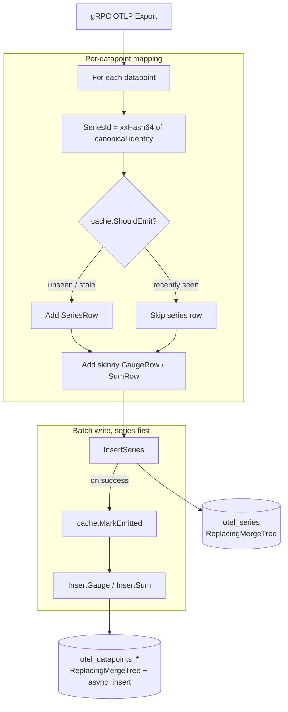

# Series / Datapoint Split — Design
> Status: approved

## Glossary
Consistent terminology used across code, schema, and docs:
- **Series** — a unique metric identity: the tuple of ServiceName, MetricName, MetricType,
  resource attributes, scope (name/version/attrs/schema), and datapoint attributes. One logical
  time-stream. (Prometheus uses the same word for the same concept.)
- **SeriesId** — a deterministic `uint64` hash of the series identity. Content-addressed: the same
  identity always yields the same id, computed locally with no coordination. Join key between the
  two table kinds.
- **Series table** (`otel_series`) — the lookup table holding one row per series identity plus its
  series-level constants. The dimension side of a star schema.
- **Datapoint** — a single observation of a series: `value + timestamp`, referencing a SeriesId.
- **Datapoint table** (`otel_datapoints_gauge`, `otel_datapoints_sum`) — skinny
  fact tables holding datapoints only. One per value shape. Named distinctly from the legacy wide
  tables so both can coexist during a migration (see `4-migration.md`).
- **Series-level constant** — a field fixed for a series (MetricType, description, unit,
  AggregationTemporality, IsMonotonic). Stored once on the series row, never per datapoint.
- **Active series** — a series seen within the dedup cache's TTL window; the working set the cache
  tracks.
- **Event time** — a datapoint's own `TimeUnix` (when it was measured). **Ingest time** — wall clock
  when we received it. They differ arbitrarily (collector buffering, retries, backfill). Every *query*
  predicate uses event time; the sole exception is `FirstSeen`/`LastSeen`, below.

`FirstSeen`/`LastSeen` on the series row are **informational only** — no query predicate reads them.
This is load-bearing: it's why cache state can never affect query correctness (see Alternatives →
windowed prune). They are **ingest time**, not event time — see §Schema for why the engine requires it.

## Approach
Introduce a content-addressed `SeriesId` = deterministic hash of the series identity, computed in
Go at ingest. A series identity is written once to `otel_series` (deduped by an in-process cache +
ClickHouse `ReplacingMergeTree`); datapoints go to skinny per-shape tables carrying only
`SeriesId + timestamp + value`. Reads resolve SeriesIds from the small series table, then range-scan
datapoints by SeriesId + time.

## SeriesId canonical encoding (normative)
The join key of the whole system, so the encoding is pinned rather than left to the implementer.

**Length-prefixed, not delimiter-separated.** Attribute keys and values are arbitrary user-controlled
UTF-8 (URLs, k8s selectors, SQL), so *no* byte is safe as a delimiter. A naive `k1=v1,k2=v2` encoding
collides **deterministically**: `{a: "b,c=d"}` and `{a: "b", c: "d"}` both render `a=b,c=d`, silently
merging two distinct series into one id. Length prefixes are unambiguous for any content:

```
lp(s)        = decimal(byte_len(s)) ":" s        // byte length (Go len), never rune count
encodeMap(m) = lp( concat, over keys sorted bytewise, of  lp(k) + lp(v) )

SeriesId = xxHash64(
    lp(ServiceName) + lp(MetricName) + lp(MetricType) + lp(ResourceSchemaUrl) +
    lp(ScopeName) + lp(ScopeVersion) + lp(ScopeSchemaUrl) +
    encodeMap(ResourceAttributes) + encodeMap(ScopeAttributes) + encodeMap(Attributes)
)                                                 // cespare/xxhash/v2, seed 0
```

`ScopeDroppedAttrCount` is **not** part of the identity (incidental counter). Unit-tested with values
containing `,`, `=`, and control bytes.

> If the migration in `4-migration.md` is ever executed, its MV must reproduce this encoding in SQL
> **byte-for-byte** — a divergence would split identities while a row-count parity check still passed.
> The equivalent ClickHouse expression is written out in `4-migration.md`. Not built here (the
> migration is documented, not implemented), so no Go↔ClickHouse parity test ships with this feature.

## Components

### SeriesId hasher (`metrics_mapper.go`)
- **Responsibility**: derive a stable `uint64` SeriesId per the canonical encoding above.
- **Interface**: `seriesID(identity) uint64`. Pure. Depends on `cespare/xxhash/v2`.

### Series dedup cache (`series_cache.go`, new)
- **Responsibility**: keep series-table writes off the per-datapoint hot path.
- **Why it matters**: without it, a series row is written **per datapoint**, turning `otel_series`
  into a second write-heavy table (write amplification + merge load). The cache collapses that to
  ~one write per series per `refreshInterval`, so series writes scale with `# series × refresh rate`,
  not datapoint count (C-3).
- **Interface — decision and record are separate, deliberately**:
  ```go
  ShouldEmit(id uint64, now time.Time) bool   // decide only; no mutation
  MarkEmitted(id uint64, now time.Time)       // called ONLY after InsertSeries returns nil
  ```
  A single `ShouldEmit` that also recorded would corrupt on failure: it marks the series emitted →
  `InsertSeries` fails → handler returns the error → the OTLP client retries → `ShouldEmit` now says
  "skip" → the datapoints land with **no series row**, invisible to every query for a full
  `refreshInterval`. Recording only after a confirmed insert closes that hole.
- **Config** (env-overridable; defaults pinned so nothing is invented at implementation time):
  `refreshInterval = 5m`, `maxEntries = 100_000`, `idleTTL = 1h`.
- **Dependencies**: `hashicorp/golang-lru/v2/expirable`.
- **Correctness never depends on cache state (C-4)** — purely write reduction. True because (a) no
  query reads `FirstSeen`/`LastSeen`, and (b) the cache only records *after* a confirmed insert.
  Losing the cache costs redundant, idempotent re-emits and nothing else.

### MetricsStore (`clickhouse_client.go`)
- **Responsibility**: create tables; upsert series rows; batch-insert skinny datapoints.
- **Interface**: `CreateTables`, `InsertSeries(ctx, []SeriesRow)`, `InsertGauge(ctx, []GaugeRow)`,
  `InsertSum(ctx, []SumRow)` (GaugeRow/SumRow skinny, identical shape).
- **Dependencies**: ClickHouse driver with `async_insert = 1` **and `wait_for_async_insert = 1`** —
  keeps server-side batching while preserving a durable ack (the `Export` handler must not return
  success before commit; OTLP clients treat success as delivered) and stops reads racing the flush.

### MetricsQuerier (`metrics_query.go`, new)
- **Responsibility**: encapsulate the two-step read so callers pass a typed filter, not SQL. Read-side
  analog of `MetricsStore`, implemented by the same `ClickHouseMetricsStore`. Not exposed over the
  network (NG-1) — it backs the integration test and any future endpoint.
- **Interface** — the time-frame is the only mandatory *filter* (C-2). `MetricType` is also required
  but is a **table selector, not a filter dimension**. Every filter is optional and emits **no SQL
  clause** when unset:
  ```go
  type DatapointQuery struct {
      From, To    time.Time         // REQUIRED — the only mandatory filter (C-2)
      MetricType  string            // REQUIRED — "gauge" | "sum"; selects the datapoint table
      ServiceName string            // optional
      MetricName  string            // optional
      Attributes  map[string]string // optional; datapoint-level attribute equality
      ResourceAttributes map[string]string // optional; resource-level attribute equality
      Limit       int               // default 10_000
  }
  type Datapoint struct {
      SeriesId    uint64
      ServiceName string    // resolved from the series row so results are self-describing
      MetricName  string
      TimeUnix    time.Time
      Value       float64
  }

  // Truncated reports that Limit was hit — results are ORDER BY (SeriesId, TimeUnix), so
  // truncation is biased (all of the lowest SeriesIds, none of the highest), never a sample.
  QueryDatapoints(ctx, DatapointQuery) (points []Datapoint, truncated bool, err error)
  ```
- **Attribute matching**: `mapContains(m, k) AND m[k] = v`, never a bare `m[k] = v` — ClickHouse
  returns `''` for a missing key, so comparing against `''` would match rows *lacking* the key.
- **`ScopeAttributes` is deliberately not filterable** (rarely queried; add later if needed). Not an
  oversight — do not "helpfully" add it.

### Export handler (`metrics_service.go`)
- **Responsibility**: map request → SeriesIds; emit series rows (gated by cache) series-first, then
  datapoints, then `MarkEmitted` for the series that were actually inserted. Wiring only.

## Data flow


Series-first, so a crash between the two inserts leaves at worst a harmless orphan series row, never
a dangling datapoint. `MarkEmitted` runs only after `InsertSeries` succeeds.

**Retry safety**: OTLP clients retry on timeout/`UNAVAILABLE` and the handler returns errors, so a
partially-failed batch **will** be re-sent. Both tables therefore collapse duplicates by sorting key —
`otel_series` via `ReplacingMergeTree`, datapoints via `ReplacingMergeTree ORDER BY (SeriesId, TimeUnix)`
(a repeated `(SeriesId, TimeUnix)` *is* a duplicate by definition). Plain `MergeTree` would have
double-counted on every retry.

## Schema changes

**`otel_series`** — `ReplacingMergeTree(LastSeen)`: repeated emits of the same series collapse to the
latest row. All identity columns are constant per `SeriesId` (they feed the hash), so "latest wins"
is a no-op for them and correct for the mutable ones (description/unit).

**`LastSeen` is the version column, and is therefore ingest time (wall clock at emit) — not event
time.** This is the one timestamp in the system that deliberately is not event time, because
`ReplacingMergeTree` resolves duplicates by *keeping the row with the highest version*. With event
time, a backfilled or clock-skewed datapoint bearing a far-future `TimeUnix` would write a series row
whose version no honest later emit can beat — freezing that series' description/unit permanently and
breaking the "latest wins" property that is the entire reason for choosing this engine. Wall clock at
emit is monotonic enough for "the most recently written row wins", which is what we actually want.
`FirstSeen` is ingest time for symmetry.

`FirstSeen`/`LastSeen` are informational (see Glossary) — no query predicate reads them, which is why
using ingest time here costs nothing. Under `ReplacingMergeTree` the surviving row carries the latest
emit's `FirstSeen`, so **`FirstSeen` is approximate** — acceptable for the same reason. (Exact `min`
would need `AggregatingMergeTree` + `SimpleAggregateFunction`, which buys nothing here and risks
version-compat issues with `SimpleAggregateFunction` over `Map(LowCardinality(...))`.)

**No TTL, deliberately.** An earlier draft put a 90-day TTL on `otel_series` only — which would delete
a dead series' row while its datapoints stayed on disk forever, making them permanently unqueryable
through the join. Retention must be symmetric or absent; absent is right for this scope. If added
later, the datapoint TTL must expire **no later than** the series TTL — and note `LastSeen` is ingest
time while the datapoint TTL would key off event-time `TimeUnix`, so the two are not directly
comparable: a series TTL must carry enough slack to cover the worst-case ingest lag.

```sql
CREATE TABLE IF NOT EXISTS otel_series (
    SeriesId               UInt64 CODEC(ZSTD(1)),
    ServiceName            LowCardinality(String) CODEC(ZSTD(1)),
    MetricName             LowCardinality(String) CODEC(ZSTD(1)),
    MetricType             LowCardinality(String) CODEC(ZSTD(1)),
    ResourceAttributes     Map(LowCardinality(String), String) CODEC(ZSTD(1)),
    ResourceSchemaUrl      String CODEC(ZSTD(1)),
    ScopeName              String CODEC(ZSTD(1)),
    ScopeVersion           String CODEC(ZSTD(1)),
    ScopeAttributes        Map(LowCardinality(String), String) CODEC(ZSTD(1)),
    ScopeDroppedAttrCount  UInt32 CODEC(ZSTD(1)),
    ScopeSchemaUrl         String CODEC(ZSTD(1)),
    Attributes             Map(LowCardinality(String), String) CODEC(ZSTD(1)),
    AggregationTemporality Int32 CODEC(ZSTD(1)),
    IsMonotonic            Bool CODEC(ZSTD(1)),
    MetricDescription      String CODEC(ZSTD(1)),
    MetricUnit             String CODEC(ZSTD(1)),
    FirstSeen              DateTime64(9) CODEC(ZSTD(1)),
    LastSeen               DateTime64(9) CODEC(ZSTD(1)),

    INDEX idx_res_attr_key   mapKeys(ResourceAttributes)   TYPE bloom_filter(0.01) GRANULARITY 1,
    INDEX idx_res_attr_value mapValues(ResourceAttributes) TYPE bloom_filter(0.01) GRANULARITY 1,
    INDEX idx_attr_key       mapKeys(Attributes)           TYPE bloom_filter(0.01) GRANULARITY 1,
    INDEX idx_attr_value     mapValues(Attributes)         TYPE bloom_filter(0.01) GRANULARITY 1
) ENGINE = ReplacingMergeTree(LastSeen)
ORDER BY (ServiceName, MetricName, SeriesId)
SETTINGS index_granularity = 8192;
```

**`otel_datapoints_gauge`** (and identical **`otel_datapoints_sum`**):

```sql
CREATE TABLE IF NOT EXISTS otel_datapoints_gauge (
    SeriesId      UInt64 CODEC(ZSTD(1)),
    StartTimeUnix DateTime64(9) CODEC(Delta(8), ZSTD(1)),
    TimeUnix      DateTime64(9) CODEC(Delta(8), ZSTD(1)),
    Value         Float64 CODEC(ZSTD(1)),
    Flags         UInt32 CODEC(ZSTD(1))
) ENGINE = ReplacingMergeTree()                    -- retried inserts collapse; see Retry safety
PARTITION BY toDate(TimeUnix)
ORDER BY (SeriesId, TimeUnix)
SETTINGS index_granularity = 8192;
```

(Histogram/Exp-Histogram/Summary tables are out of scope per NG-2.)

## Canonical read query
What `MetricsQuerier.QueryDatapoints` builds. Clauses for unset filters are omitted entirely:

```sql
SELECT s.SeriesId, s.ServiceName, s.MetricName, dp.TimeUnix, dp.Value
FROM otel_datapoints_gauge AS dp
INNER JOIN (
        SELECT DISTINCT SeriesId, ServiceName, MetricName
        FROM otel_series
        WHERE MetricType = :type                   -- narrows the join's build side
          -- AND ServiceName = :service            -- emitted only when set
          -- AND MetricName  = :metric             -- emitted only when set
          -- AND mapContains(Attributes, :k) AND Attributes[:k] = :v
    ) AS s ON s.SeriesId = dp.SeriesId
WHERE dp.TimeUnix BETWEEN :from AND :to            -- authoritative bound + partition prune
ORDER BY dp.SeriesId, dp.TimeUnix
LIMIT 1 BY dp.SeriesId, dp.TimeUnix                -- collapse not-yet-merged Replacing duplicates
LIMIT :limit;
```

**`DISTINCT` is required, not cosmetic.** `otel_series` may hold several unmerged rows per `SeriesId`
(merges are eventual). An `INNER JOIN` **multiplies** by duplicate right-side keys rather than
absorbing them — three unmerged rows would fan out every datapoint three times. `DISTINCT` collapses
them exactly, since the projected columns are identity columns and therefore constant per `SeriesId`.
(An `IN (subquery)` semi-join would also absorb duplicates, but can't project ServiceName/MetricName.)

**No `FINAL`, deliberately.** The subquery reads only identity columns — constant per `SeriesId` — so
unmerged parts carry identical values and raw-row filtering is already correct. `FINAL` would only be
needed to read a *merged* column (`FirstSeen`/`LastSeen`, description/unit), and no predicate does.

`LIMIT 1 BY` handles the datapoint side: `ReplacingMergeTree` dedups only *eventually*, so a read
before merge could otherwise see a retried datapoint twice.

**Counting rows per series (tests) is the one place `FINAL` is required.** `ReplacingMergeTree` dedups
lazily, so immediately after ingest `otel_series` legitimately holds several unmerged rows per
`SeriesId` and a bare `SELECT count()` would flake. AC-2 is a claim about the *logical* row count, so
assert it with `SELECT count() FROM otel_series FINAL` (or `count(DISTINCT SeriesId)`). This does not
contradict the paragraph above: the read path needs no `FINAL` because it never reads a merged column,
whereas a row *count* is precisely a question about the merged state.

## Metrics
- `series_registered_total` — counter, series rows emitted (want ≪ datapoints ingested).
- `series_cache_size` — gauge, active series tracked.
(Reuse existing `metricsReceivedCounter` for ingest volume.)

**Exposure**: instruments register on the existing global `MeterProvider` (`otel.go`), which exports
to **stdout** — unchanged in this feature. OTLP self-export is a separate roadmap feature (004).

**Logging guidance** (throughout implementation): log heavily but meaningfully — every line carries
enough context to debug from alone, and no line is noise. Structured `slog` with the request context.
- Include `SeriesId`, `ServiceName`, `MetricName`, `MetricType`, batch sizes, counts (datapoints in /
  series emitted vs deduped).
- `Debug` for hot-path detail, `Info` for lifecycle, `Warn`/`Error` for failures.
- **Log an error exactly once, at the point it's handled.** Propagating functions don't log.
- Never log per-datapoint at `Info`+; aggregate to per-batch counts (keeps logging off the hot path, C-3).

## Alternatives considered
- **Windowed activity prune on the series subquery (rejected — was in an earlier draft)**: filtering
  the subquery by `LastSeen >= :from AND FirstSeen <= :to` to shrink the join's build side **silently
  drops live data**. `LastSeen` only advances when the cache lets an emit through, so it lags by up to
  `refreshInterval`: a series ingesting *right now* but last emitted 50 min ago is pruned from a "last
  5 minutes" query. Worse, those columns are ingest time while `:from`/`:to` filter *event* time — an
  unbounded skew under collector buffering or backfill, so shrinking `refreshInterval` cannot fix it.
  A correct version needs event-time columns **plus** a declared out-of-orderness bound with padded
  predicates and emit-on-backward-extension — i.e. watermark semantics, whose skew bound becomes a
  *correctness knob that loses data when misconfigured*. Its only win is a smaller build side, and each
  extra id costs one cheap PK seek inside already-partition-pruned data. Not worth it.
- **`AggregatingMergeTree` + `SimpleAggregateFunction` on `otel_series` (rejected)**: needed only to
  keep `FirstSeen` an exact `min`. Nothing reads `FirstSeen`, so it buys nothing — and
  `SimpleAggregateFunction` over `Map(LowCardinality(String), String)` is exactly the combination
  ClickHouse may reject. `ReplacingMergeTree` is simpler and sufficient.
- **Plain `MergeTree` datapoints (rejected)**: appends duplicates on the OTLP retries that happen
  routinely, double-counting values. `ReplacingMergeTree` costs slightly heavier merges and a
  `LIMIT 1 BY` on pre-merge reads — a good trade against silently wrong values.
- **Insert-time MV fan-out (rejected)**: structural atomicity, but the series MV amplifies (one row per
  datapoint) and adds synchronous insert-path CPU — bad for write-heavy. App-side dedup decouples the
  hot path for less. See C-3, C-4.
- **UUID SeriesId (rejected)**: random ids force a read-before-write to dedup. A deterministic hash is
  content-addressed → lookup-free, coordination-free dedup, and smaller (UInt64) per datapoint.

## Migration & compatibility
- **Ingest contract unchanged** — the gRPC OTLP `Export` surface is identical; producers need no
  change. The break is internal-only (`MetricsStore` Go interface + table schema), no external consumer.
- **Datapoint tables are named `otel_datapoints_<shape>`**, never reusing the legacy
  `otel_metrics_<shape>` wide-table names — avoids the `CREATE TABLE IF NOT EXISTS` trap (it silently
  keeps an existing table's old schema) and lets new and legacy tables coexist during a migration.
  The `otel_datapoints_` prefix also groups the fact tables together, apart from the legacy set.
- **Greenfield (this deploy)**: forward-only — create the new schema, done.
- **Existing wide-table deployment**: documented in `4-migration.md`. **Not implemented** in this
  feature.

## Risks
- **Hash collision** — negligible with 64-bit hash at low cardinality; widen if ever needed. (The
  *deterministic* collision risk from delimiter-based encoding is eliminated by length prefixing.)
- **`FirstSeen` is approximate** under `ReplacingMergeTree` — safe only because nothing reads it. If a
  future feature depends on it, revisit the engine.
- **Series-constant drift** (a producer flipping temporality/monotonicity mid-stream) — latest wins on
  the series row; if it must be distinguished, include it in the identity so drift mints a new series.
- **Transient duplicate datapoints** before a `ReplacingMergeTree` merge — absorbed at read by
  `LIMIT 1 BY (SeriesId, TimeUnix)`.
- **Biased truncation** — `Limit` cuts by `(SeriesId, TimeUnix)` order, so a truncated result holds all
  of the lowest SeriesIds and none of the highest. Surfaced via the `truncated` return, never silent.
- **Cold-start burst** — bounded and idempotent; the cache warm-read is a separate feature (NG-4).
- **No retention** — tables grow without bound. Deliberate for this scope; symmetric TTLs are the fix.
- **Multi-instance (NG-3)** — the cache is per-process, so N instances emit up to N× series rows; they
  collapse, because `SeriesId` is content-addressed and `otel_series` is `ReplacingMergeTree`. No
  coordination needed. The one skew: `LastSeen` is each instance's wall clock, so "latest wins" is
  really "highest clock wins" — observable only on `MetricDescription`/`MetricUnit` (identity columns
  are constant per `SeriesId`, so a wrong winner is a no-op there). Harmless at NTP skew.
